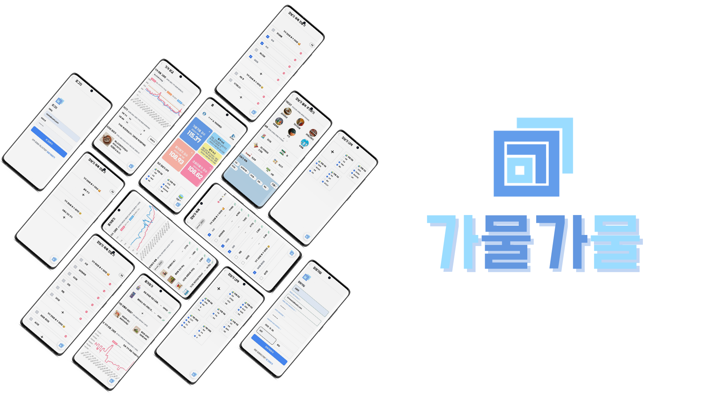

# 💶 가물가물


**가물가물(GMGM)**은 장바구니 목록, 농산물 및 생필품의 가격 추이를 제공하고, 사용자의 즐겨찾기 상품을 바탕으로 지수를 산정하여 보여주는 장바구니 체크리스트 서비스입니다. 장보기 시 편하게 사용할 수 있도록 모바일 서비스로 기획했습니다. 가물가물 프로젝트의 기획 의도는 가격 추이 및 물가지수 계산 서비스 제작과 빅데이터 분산 처리 개발 경험입니다. 사용자의 즐겨찾기 품목을 기반으로 맞춤형 제품 추천을 제공합니다.

**가물가물** : 가***물가***물한 물가를 알 수 있는 **가물가물**!


### 목차

[프로젝트 기획](#💡-프로젝트-기획)
- 기획 배경
- 주요 서비스 기능
- 와이어프레임
- UI 디자인
- Mockup
- ERD

[결과물](#💜-결과물)

[기술스택](#🛠️-기술-스택)

[팀소개](#팀-소개)


## 💡 프로젝트 기획

### 기획 배경

- 소비자 물가지수와 우리가 실제로 체감하는 물가 지수의 괴리를 줄이는 서비스
- 당장 나에게 필요한 상품들의 물가를 잘 파악하여 합리적인 소비를 도울 수 있는 서비스

### 주요 서비스 기능

- 소비자 물가지수 조회, 추이 파악
- 물가에 더욱 밀접하게 관련된 상품들로 만들어진 지수 제공
- 개인화된 물가 지수 제공
- 물가 관련 기사 조회
- 즐겨찾기
    - 상품으로 구독된 상품의 가격 증감 확인
    - 구독된 상품들을 기반으로 추천
    - 구독된 상품들의 대체 상품과 비교, 계산을 통한 비교
    - 오프라인과 온라인 가격 확인
    - 구독된 상품들을 기반으로 개인화된 물가 지수 확인
- 장바구니 (체크리스트)
    - 가격 비교 가능한 품목 추가
    - 사용자 정의 항목 추가
    - 품목의 상품들을 비교


### Wire Frame

  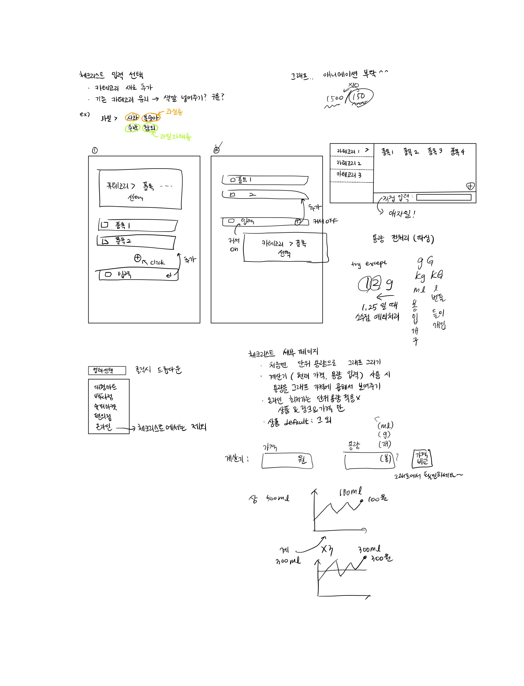
  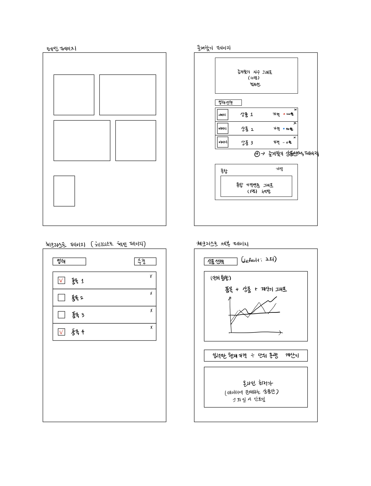
  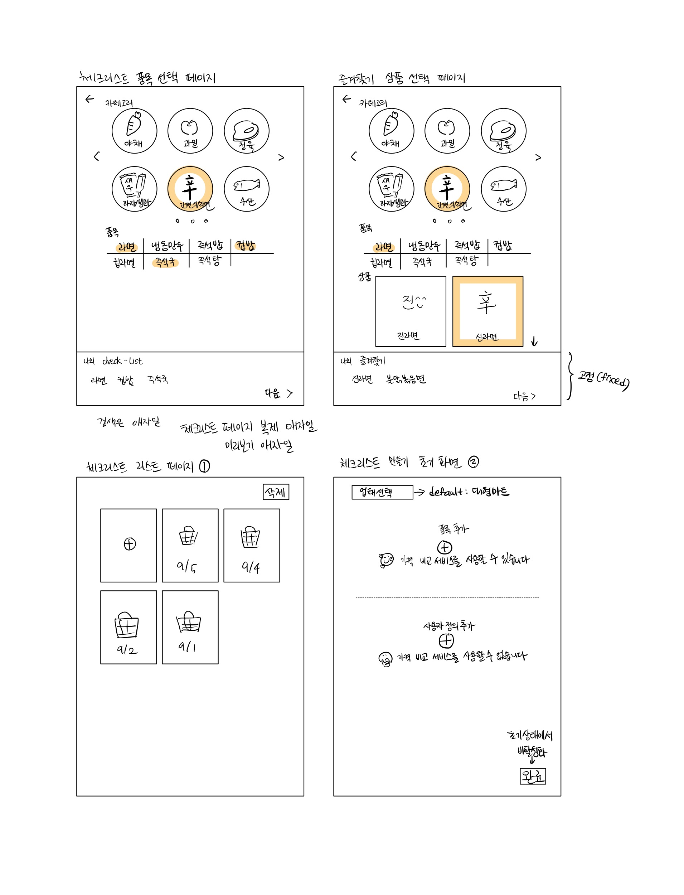
  

### Mockup

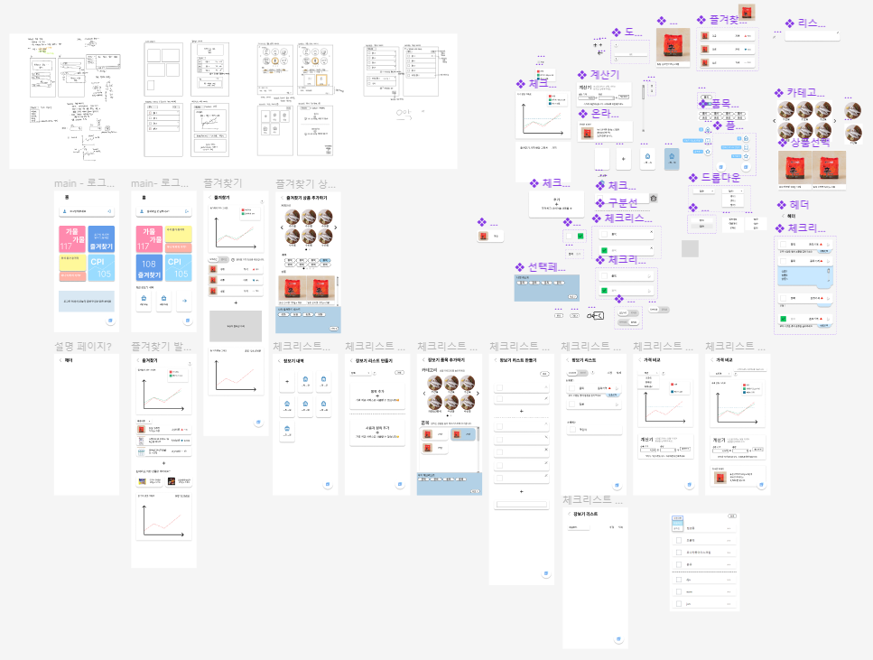

### ERD

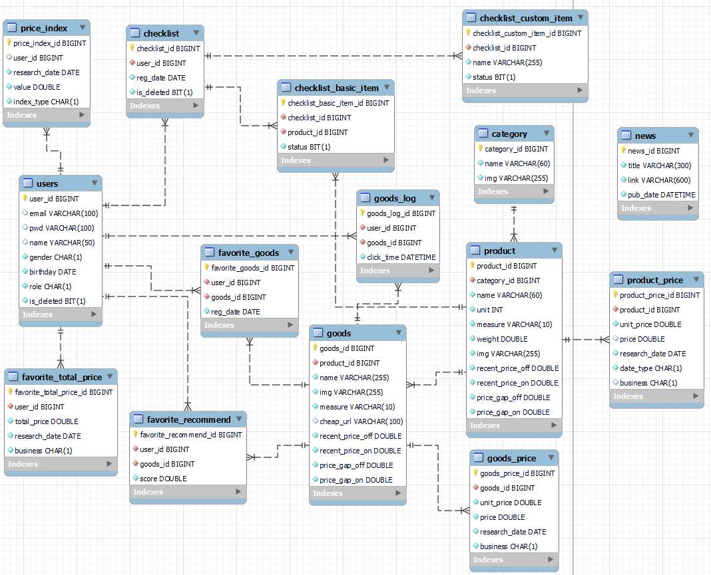

## 💜 결과물

### main 
  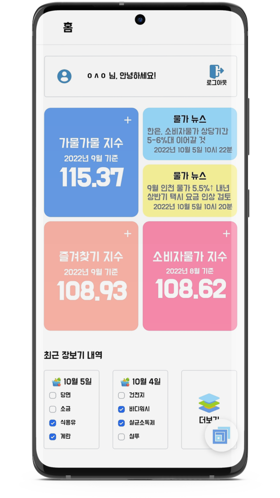
  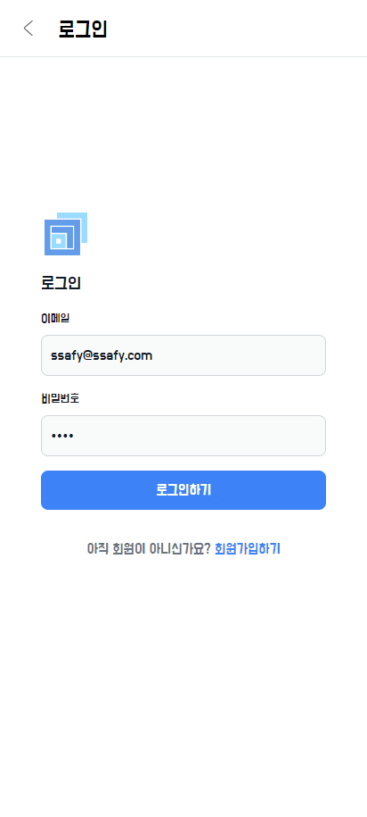
 

### 장보기 리스트
  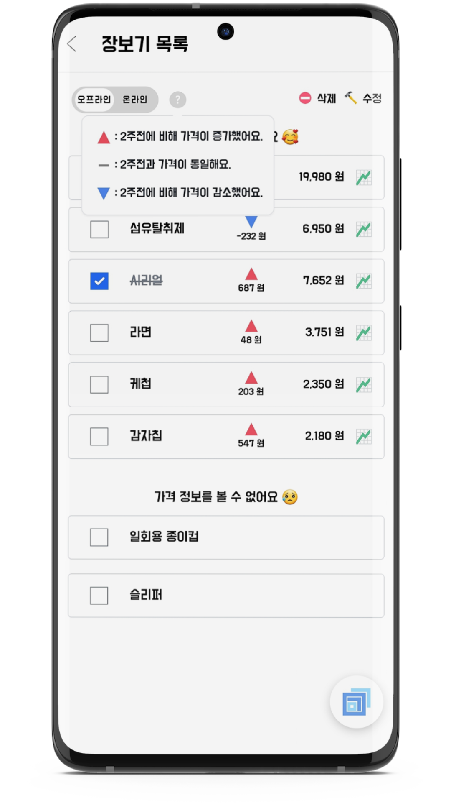
  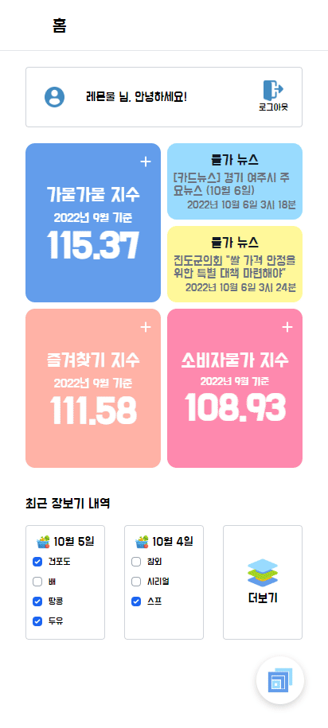
 

### 즐겨찾기
  
  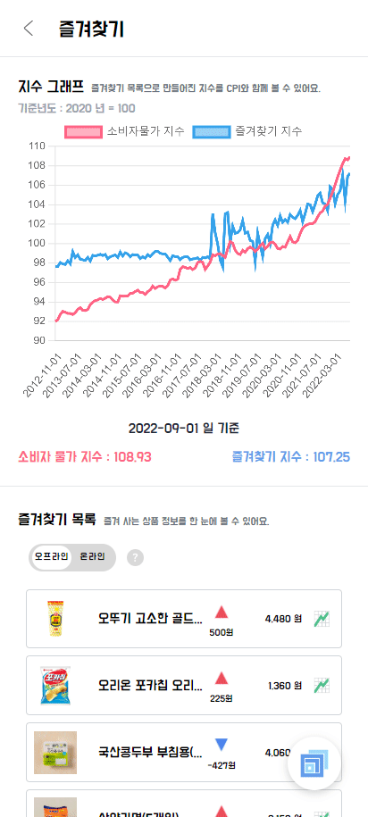
 
### 가격 비교
  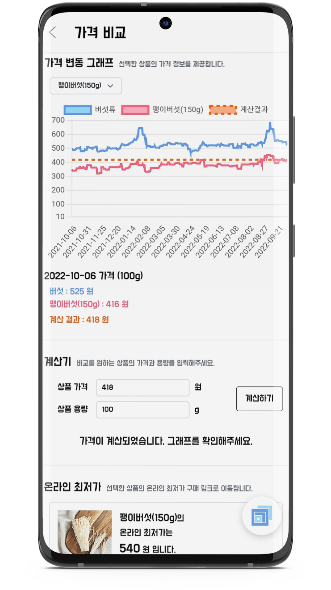

 
 

## 🛠️ 기술 스택

### Backend


### Frontend


### Data


### Infra


### 시스템 아키텍처

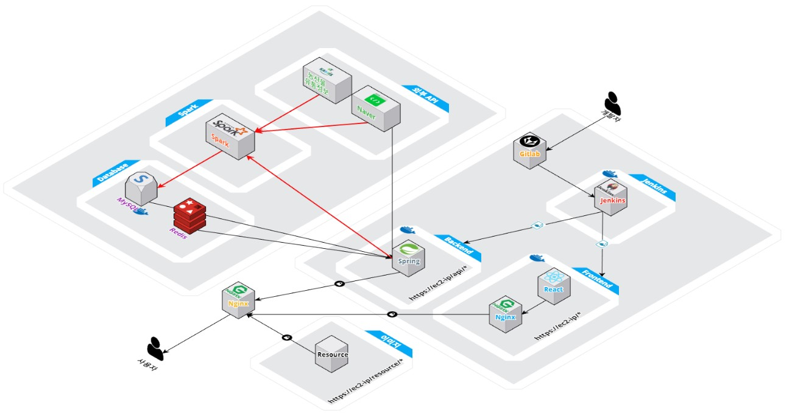

## 

## 서비스 구조

```markdown
📂gamulgamul
┣ 📦backend
┣ 📦data
┣ 📦frontend
┗ 📜README.md
```

- gamulgamul
  
  - backend
    
    ```markdown
    📦backend
    ┣ 📂gradle
    ┃ ┗ 📂wrapper
    ┃ ┃ ┣ 📜gradle-wrapper.jar
    ┃ ┃ ┗ 📜gradle-wrapper.properties
    ┣ 📂src
    ┃ ┣ 📂main
    ┃ ┃ ┣ 📂java
    ┃ ┃ ┃ ┗ 📂com
    ┃ ┃ ┃ ┃ ┗ 📂lemonmul
    ┃ ┃ ┃ ┃ ┃ ┗ 📂gamulgamul
    ┃ ┃ ┃ ┃ ┃ ┃ ┣ 📂api
    ┃ ┃ ┃ ┃ ┃ ┃ ┃ ┣ 📂dto
    ┃ ┃ ┃ ┃ ┃ ┃ ┃ ┃ ┣ 📂checklist
    ┃ ┃ ┃ ┃ ┃ ┃ ┃ ┃ ┣ 📂detail
    ┃ ┃ ┃ ┃ ┃ ┃ ┃ ┃ ┣ 📂favorite
    ┃ ┃ ┃ ┃ ┃ ┃ ┃ ┃ ┣ 📂main
    ┃ ┃ ┃ ┃ ┃ ┃ ┃ ┃ ┣ 📂news
    ┃ ┃ ┃ ┃ ┃ ┃ ┃ ┃ ┣ 📂user
    ┃ ┃ ┃ ┃ ┃ ┃ ┃ ┃ ┣ 📂zeppelin
    ┃ ┃ ┃ ┃ ┃ ┃ ┃ ┣ 📜ChecklistApi.java
    ┃ ┃ ┃ ┃ ┃ ┃ ┃ ┣ 📜DetailApi.java
    ┃ ┃ ┃ ┃ ┃ ┃ ┃ ┣ 📜FavoriteApi.java
    ┃ ┃ ┃ ┃ ┃ ┃ ┃ ┣ 📜MainApi.java
    ┃ ┃ ┃ ┃ ┃ ┃ ┃ ┗ 📜UserApi.java
    ┃ ┃ ┃ ┃ ┃ ┃ ┣ 📂config
    ┃ ┃ ┃ ┃ ┃ ┃ ┣ 📂entity
    ┃ ┃ ┃ ┃ ┃ ┃ ┃ ┣ 📂checklist
    ┃ ┃ ┃ ┃ ┃ ┃ ┃ ┣ 📂favorite
    ┃ ┃ ┃ ┃ ┃ ┃ ┃ ┣ 📂goods
    ┃ ┃ ┃ ┃ ┃ ┃ ┃ ┣ 📂priceindex
    ┃ ┃ ┃ ┃ ┃ ┃ ┃ ┣ 📂product
    ┃ ┃ ┃ ┃ ┃ ┃ ┃ ┣ 📂user
    ┃ ┃ ┃ ┃ ┃ ┃ ┃ ┣ 📜BusinessType.java
    ┃ ┃ ┃ ┃ ┃ ┃ ┃ ┣ 📜Category.java
    ┃ ┃ ┃ ┃ ┃ ┃ ┃ ┗ 📜News.java
    ┃ ┃ ┃ ┃ ┃ ┃ ┣ 📂exhandler
    ┃ ┃ ┃ ┃ ┃ ┃ ┣ 📂repo
    ┃ ┃ ┃ ┃ ┃ ┃ ┣ 📂security
    ┃ ┃ ┃ ┃ ┃ ┃ ┣ 📂service
    ┃ ┃ ┃ ┃ ┃ ┃ ┣ 📂util
    ┃ ┃ ┃ ┃ ┃ ┃ ┃ ┗ 📜ScheduledTasks.java
    ┃ ┃ ┃ ┃ ┃ ┃ ┗ 📜GamulgamulApplication.java
    ┃ ┃ ┗ 📂resources
    ┃ ┃ ┃ ┗ 📜errors.properties
    ┣ 📜.gitignore
    ┣ 📜build.gradle
    ┣ 📜Dockerfile
    ┣ 📜gradlew
    ┣ 📜gradlew.bat
    ┗ 📜settings.gradle
    ```
  
  - data
    
    ```markdown
    📦data
    ┣ 📂assets
    ┣ 📂colab
    ┣ 📂DB넣을데이터
    ┃ ┣ 📂asset
    ┣ 📂Zeppelin
    ┃ ┣ 📂Data적재
    ┃ ┃ ┣ 📂ipynb
    ┃ ┃ ┃ ┣ 📜[API]01*favorite_total_price_and_price_index_f..ipynb
    ┃ ┃ ┃ ┣ 📜[base]01_category_table..ipynb
    ┃ ┃ ┃ ┣ 📜[base]02_product_table..ipynb
    ┃ ┃ ┃ ┣ 📜[base]03_goods_table..ipynb
    ┃ ┃ ┃ ┣ 📜[base]04_goods_price_table..ipynb
    ┃ ┃ ┃ ┣ 📜[base]05_product_price_table..ipynb
    ┃ ┃ ┃ ┣ 📜[daily]01_api_file_Null파악\_toStorage..ipynb
    ┃ ┃ ┃ ┣ 📜[daily]02_naver_api_file_DB(x)\_API(o)\_toDB..ipynb
    ┃ ┃ ┃ ┣ 📜[daily]03_api_file_DB(o)\_API(x)\_toDB..ipynb
    ┃ ┃ ┃ ┣ 📜[daily]04_api_file_DB(o)\_API(o)\_toDB..ipynb
    ┃ ┃ ┃ ┣ 📜[daily]05_goods_table_cheapurl..ipynb
    ┃ ┃ ┃ ┣ 📜[daily]06_product_price_table..ipynb
    ┃ ┃ ┃ ┣ 📜[daily]07_favorite_recommend..ipynb
    ┃ ┃ ┃ ┣ 📜[daily]08_favorite_total_price..ipynb
    ┃ ┃ ┃ ┣ 📜[daily]NongSanMul_mart..ipynb
    ┃ ┃ ┃ ┣ 📜[daily]TP_mart_and_TP_NongSanMul_online..ipynb
    ┃ ┃ ┃ ┣ 📜[daily_nong]01_DBo_APIx_DBo_APIo_DBx_APIo수정..ipynb
    ┃ ┃ ┃ ┣ 📜[daily_nong]02_goods_price_table*수정..ipynb
    ┃ ┃ ┃ ┣ 📜[daily_nong]03*product_price_table*수정..ipynb
    ┃ ┃ ┃ ┣ 📜[daily_nong]04*favorite_total_price_table*수정..ipynb
    ┃ ┃ ┃ ┣ 📜[DELETE]01*MySQL로*데이터삭제..ipynb
    ┃ ┃ ┃ ┣ 📜[monthly]01*product_price_table..ipynb
    ┃ ┃ ┃ ┣ 📜[monthly]02_price_index_g..ipynb
    ┃ ┃ ┃ ┣ 📜[monthly]03_price_index_c..ipynb
    ┃ ┃ ┃ ┣ 📜[Once]01_api_file_Null파악(kamis_API만)\_toStorage..ipynb
    ┃ ┃ ┃ ┗ 📜[Once]08*농산물대형마트*참가격온라인과대형마트*합치기*and..ipynb
    ┃ ┃ ┗ 📂zpln
    ┃ ┣ 📂DB_to_local
    ┃ ┃ ┣ 📜5개*테이블*로컬에저장..ipynb
    ┃ ┃ ┗ 📜5개*테이블*로컬에저장\_2HEW4AUXW.zpln
    ┃ ┣ 📂Preprocessing
    ┃ ┃ ┣ 📂ipynb
    ┃ ┃ ┃ ┣ 📜1_goods_price*일데이터채우기..ipynb
    ┃ ┃ ┃ ┣ 📜2*goods_id의\_product_id*수정*(탕종숙식빵)..ipynb
    ┃ ┃ ┃ ┣ 📜3_product_price_table*수정..ipynb
    ┃ ┃ ┃ ┣ 📜[Nong_base]1*get_base_data_of_NongSanMul..ipynb
    ┃ ┃ ┃ ┣ 📜[Nong_base]2_1년농산물일데이터\_and*새로운pickle5가지생성..ipynb
    ┃ ┃ ┃ ┣ 📜[Nong_base]3*농산물*품목id바뀐것반영*goods_table변경..ipynb
    ┃ ┃ ┃ ┣ 📜[Nong_base]4*농산물*품목id바뀐것반영\_product_table변경..ipynb
    ┃ ┃ ┃ ┣ 📜[Nong_base]5*농산물*productId_productName_and_goodsId_goodsName_pickle..ipynb
    ┃ ┃ ┃ ┣ 📜[Nong_base]6_product_price의\_date_type_m*경우\_productId변경..ipynb
    ┃ ┃ ┃ ┗ 📜[Nong_base]7_product_table_column추가..ipynb
    ┃ ┃ ┗ 📂zpln
    ┃ ┗ 📂예시코드
    ┃ ┃ ┣ 📂ipynb
    ┃ ┃ ┃ ┣ 📜DASHBOARD..ipynb
    ┃ ┃ ┃ ┣ 📜datetime_and_dateutil..ipynb
    ┃ ┃ ┃ ┣ 📜MySQL_Data삭제..ipynb
    ┃ ┃ ┃ ┣ 📜MySQL_DB지우고추가하기..ipynb
    ┃ ┃ ┃ ┣ 📜MySQL_Dynamic_form..ipynb
    ┃ ┃ ┃ ┣ 📜MySQL_INSERT_VALUES..ipynb
    ┃ ┃ ┃ ┣ 📜MySQL_refreshInterval..ipynb
    ┃ ┃ ┃ ┣ 📜Pandas_DFtoList..ipynb
    ┃ ┃ ┃ ┣ 📜Pandas_isinList..ipynb
    ┃ ┃ ┃ ┣ 📜Pandas_print_option..ipynb
    ┃ ┃ ┃ ┣ 📜Pandas_strcontains..ipynb
    ┃ ┃ ┃ ┣ 📜paragraph_request..ipynb
    ┃ ┃ ┃ ┣ 📜sparkDF_filter..ipynb
    ┃ ┃ ┃ ┣ 📜sparkDF_groupBy..ipynb
    ┃ ┃ ┃ ┣ 📜sparkDF_null처리..ipynb
    ┃ ┃ ┃ ┣ 📜sparkDF_sparkDFcolumn_ToList..ipynb
    ┃ ┃ ┃ ┣ 📜sparkDF_union..ipynb
    ┃ ┃ ┃ ┣ 📜spark_Dynamic_form..ipynb
    ┃ ┃ ┃ ┗ 📜spark_jdbc..ipynb
    ┃ ┃ ┗ 📂zpln
    ┣ 📂데이터전처리중간결과
    ┣ 📜.gitignore
    ┣ 📜README.md
    ┗ 📜전처리.md
    ```
  
  - frontend
    
    ```markdown
    📦frontend
    ┣ 📂public
    ┣ 📂src
    ┃ ┣ 📂assets
    ┃ ┃ ┣ 📂icons
    ┃ ┣ 📂components
    ┃ ┃ ┣ 📂charts
    ┃ ┃ ┣ 📂checkList
    ┃ ┃ ┃ ┣ 📂UI
    ┃ ┃ ┣ 📂Detail
    ┃ ┃ ┣ 📂favorite
    ┃ ┃ ┣ 📂main
    ┃ ┃ ┣ 📂NavBtn
    ┃ ┃ ┣ 📂SelectProduct
    ┃ ┃ ┃ ┣ 📂checkList
    ┃ ┃ ┃ ┣ 📂UI
    ┃ ┃ ┣ 📂users
    ┃ ┣ 📂modules
    ┃ ┣ 📂routers
    ┃ ┃ ┣ 📂APIs
    ┃ ┃ ┣ 📂pages
    ┃ ┃ ┃ ┣ 📂CheckList
    ┃ ┃ ┃ ┃ ┣ 📜CheckList.tsx
    ┃ ┃ ┃ ┃ ┣ 📜CheckLists.tsx
    ┃ ┃ ┃ ┃ ┗ 📜CheckListSelection.tsx
    ┃ ┃ ┃ ┣ 📂Detail
    ┃ ┃ ┃ ┃ ┗ 📜Detail.tsx
    ┃ ┃ ┃ ┣ 📂Favorite
    ┃ ┃ ┃ ┃ ┣ 📜Favorite.tsx
    ┃ ┃ ┃ ┃ ┣ 📜FavoriteIndex.tsx
    ┃ ┃ ┃ ┃ ┗ 📜FavoriteListSelection.tsx
    ┃ ┃ ┃ ┣ 📂user
    ┃ ┃ ┃ ┃ ┣ 📜LogIn.tsx
    ┃ ┃ ┃ ┃ ┗ 📜SignUpPage.tsx
    ┃ ┃ ┃ ┣ 📜Main.tsx
    ┃ ┃ ┃ ┣ 📜README.md
    ┃ ┃ ┃ ┗ 📜Spinner.tsx
    ┃ ┃ ┣ 📜NavBtn.tsx
    ┃ ┃ ┣ 📜NotFound.tsx
    ┃ ┃ ┗ 📜README.md
    ┃ ┣ 📜App.test.tsx
    ┃ ┣ 📜App.tsx
    ┃ ┣ 📜index.css
    ┃ ┣ 📜index.tsx
    ┣ 📜.gitignore
    ┣ 📜.prettierrc.js
    ┣ 📜craco.config.js
    ┣ 📜Dockerfile
    ┣ 📜package-lock.json
    ┣ 📜package.json
    ┣ 📜postcss.config.js
    ┣ 📜README.md
    ┣ 📜tailwind.config.js
    ┣ 📜tailwind.js
    ┣ 📜tsconfig.extend.json
    ┗ 📜tsconfig.json
    ```

## 팀 소개

### SSAFY 7기 구미 1반 D108팀

### Team. lemonmul

한잔의 🍋레몬물🍋로 시작하는 갓생을 사는 그/그녀들에게 꽂혀버린 팀원들

###  [Team Notion](https://www.notion.so/39f9e8d9911c4802b6266b3af391d1c0)


### Teammates

| 이름     | 엄성현                                     | 임소연                               | 지승영                                     | 정동규                                   | 전효인                                   | 김효은                                         |
|:------:|:---------------------------------------:|:---------------------------------:|:---------------------------------------:|:-------------------------------------:|:-------------------------------------:|:-------------------------------------------:|
| 포지션    | FE                                      | Data                              | Data                                    | BE, Infra                             | BE                                    | BE, 팀장                                      |
| Github | [eomsteve](https://github.com/eomsteve) | [Im-sy](https://github.com/Im-sy) | [jisy2718](https://github.com/jisy2718) | [1217jdk](https://github.com/1217jdk) | [zaq1290](https://github.com/zaq1290) | [Chosephine](https://github.com/Chosephine) |

### Team Notion

- [Link](https://www.notion.so/39f9e8d9911c4802b6266b3af391d1c0)
